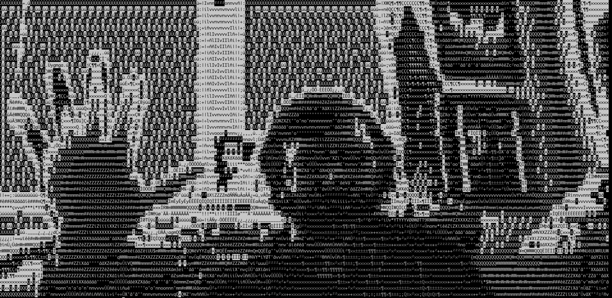

# webcamToCLI

Couldn't find an easy way to view camera in terminal, and nothing that worked cross-platform. But this does!


```bash
git clone https://github.com/frigginglorious/webcamToCLI
cd webcamToCLI
python3  webcamToCLI.py
```



## Install Dependencies
### Raspbian
```bash
sudo apt install python3-pip
pip3 install python-aalib
pip3 install opencv-python
sudo apt install libatlas-base-dev
```

### macOS
```bash
brew install aalib
brew install opencv
brew install wget
wget https://raw.githubusercontent.com/jwilk/python-aalib/master/aalib.py -P /usr/local/lib/python3.9/site-packages/
pip3 install python-aalib
pip3 install opencv-python
```


##Todo
The [python-aalib](http://jwilk.net/software/python-aalib) project needs love to give it better ansii color graphics. Or I have to learn how to use C.# webcamToCLI
